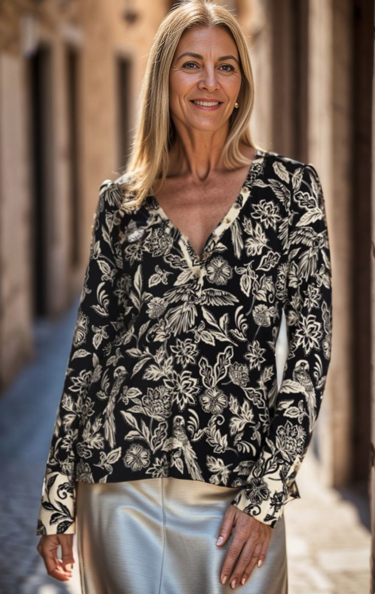
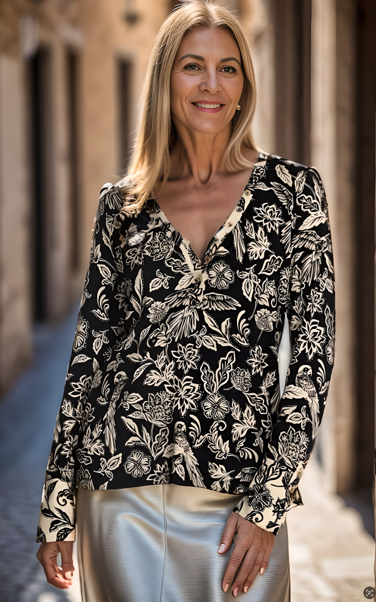
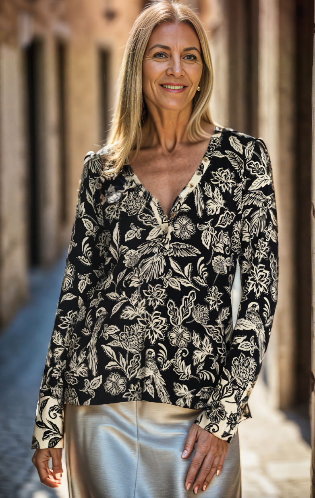
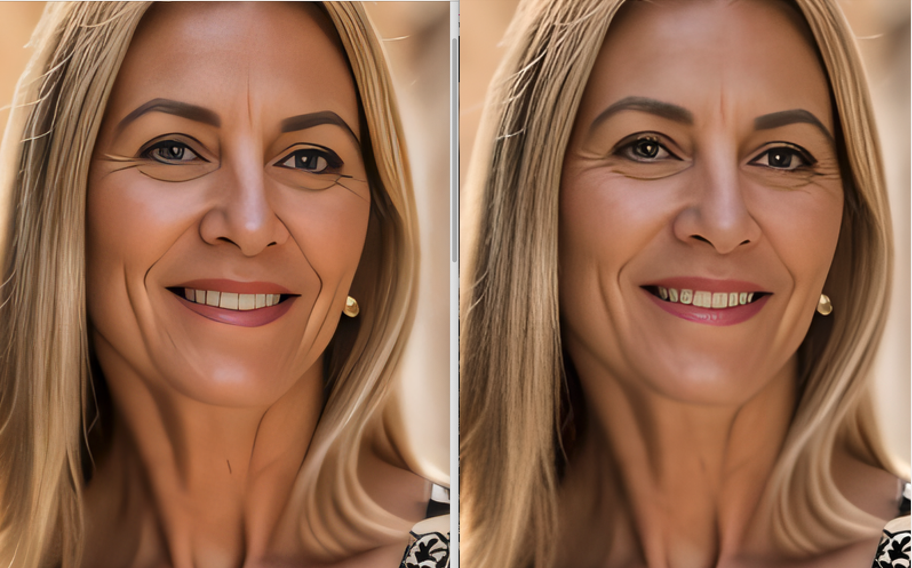
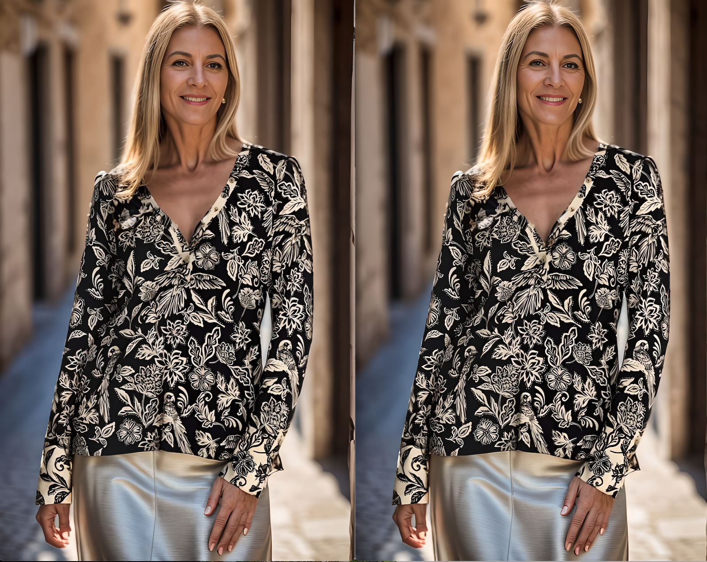
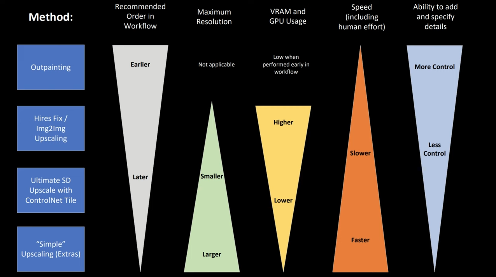
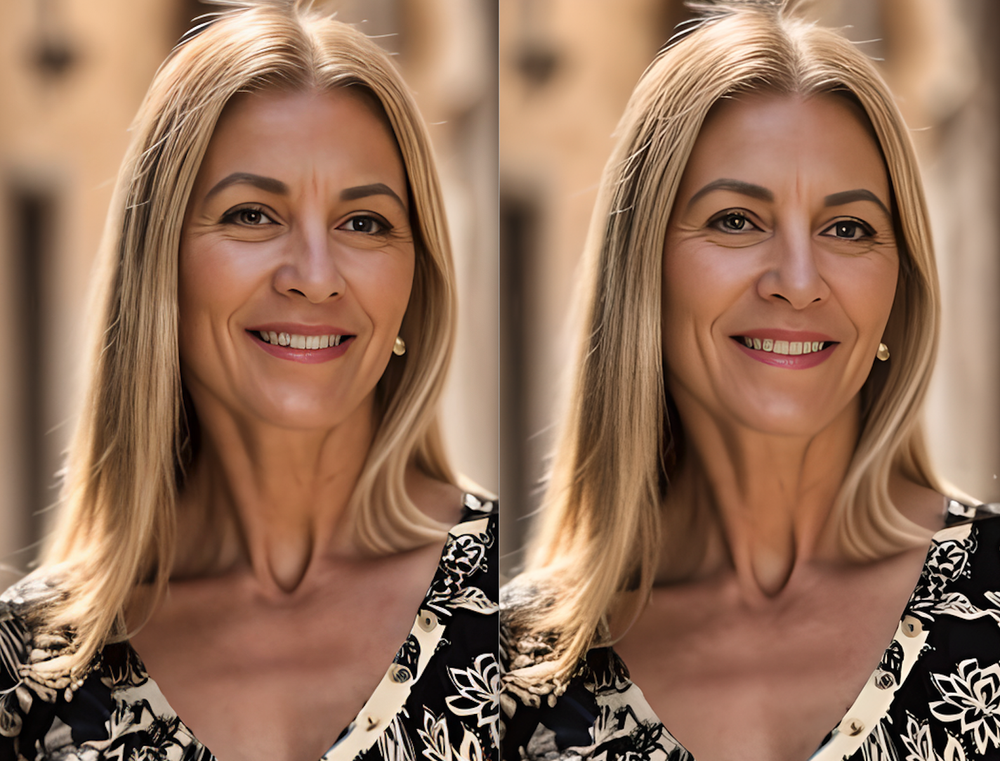
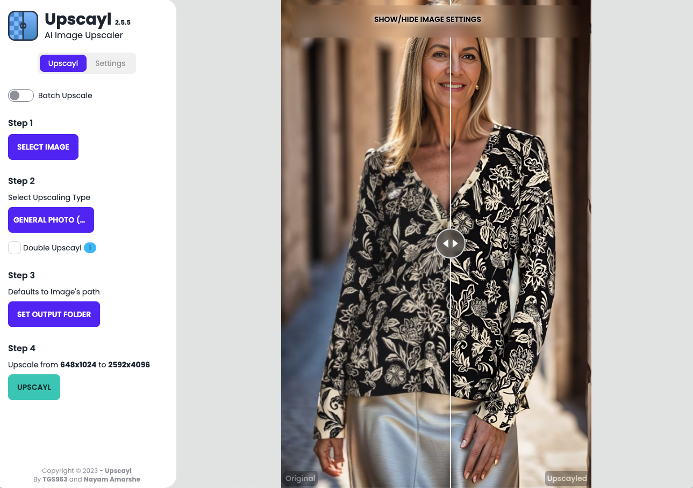
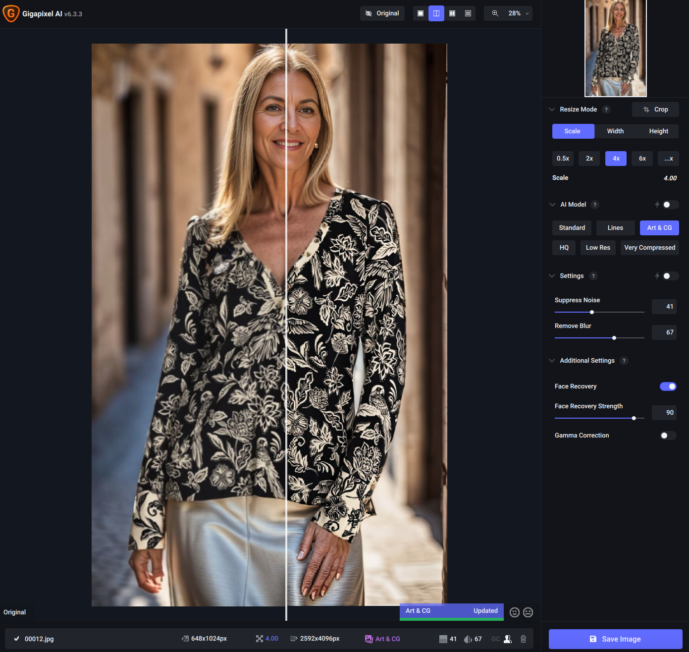

# 图像高清化方法

[TOC]

>Update log:
>
>* 2023-09-15: init

> 翻译+参考链接：
>
> * [How to use AI image upscaler to improve details](https://stable-diffusion-art.com/ai-upscaler/)
> * [3 methods to upscale images in Stable Diffusion (ControlNet tile upscale, SD upscale, AI upscale)](https://stable-diffusion-art.com/controlnet-upscale/)
> * [How to Upscale to any resolution using the Power of ControlNet's Tile and Ultimate SD Upscale](https://www.andyhtu.com/post/how-to-upscale-to-any-resolution-using-the-power-of-controlnets-tile-and-ultimate-sd-upscale)
> * [如何用 Stable Diffusion 產生高解析度的圖？](https://koding.work/generate-high-resolution-images-with-stable-diffusion/)
> * [七种放大方法对比](https://www.youtube.com/watch?v=b6l4E45hBNo)

像 ESRGAN 这样的 AI 图像放大器是提高 Stable Diffusion 生成的图像质量的不可或缺的工具。事实上，它非常常用，以至于许多 Stable Diffusion GUI 都内置了对它的支持。

Stable Diffusion v1 的默认图像大小为 **512×512像素**这在今天的标准中是相当低的。让我们以 iPhone 12 为例。它的相机可以产生 12MP 的图像，即 4032×3024 像素。它的屏幕显示 2532 x 1170 像素，因此未缩放的稳定扩散图像需要放大，否则看起来质量很低。

更为复杂的是，“稳定扩散”生成的复杂场景往往没有应有的清晰度。它经常在细节上挣扎。

调整图像大小的传统算法，如[最近邻算法](https://en.wikipedia.org/wiki/Image_scaling#Nearest-neighbor_interpolation)插值和 [Lanczos](https://en.wikipedia.org/wiki/Lanczos_resampling) 插值法由于仅使用图像的像素值而被人诟病。他们通过只使用图像的像素值执行数学运算来放大画布并填充新像素。然而，如果图像本身被破坏或失真，这些算法就无法准确地填充缺失的信息。

相比之下，人工智能的放大算法是用大量数据训练的模型。

高质量的图像首先被人为破坏，以模拟真实世界的退化。然后将退化的图像缩小到更小的尺寸。然后训练神经网络模型以恢复原始图像。大量的先验知识被嵌入到模型中。它能够填补缺失的信息。就好像人类不需要仔细研究一个人的脸就能记住它。我们主要关注几个关键特征。

以下是比较传统（Lanczos）和AI（R-ESRGAN）放大高清的示例。由于 AI 高清化程序中嵌入了知识，它可以高清化图像并同时恢复细节。

<table>   
    <tr>     
        <td>       
                   
            
原图
     
        </td>     
        <td>       
                   
            
Lanczos 放大
     
        </td>     
        <td>       
                   
            
R-ESRGAN 4x+ 放大
     
        </td>    
        <td>       
                   
            
LDSR 放大
     
        </td>  
    </tr>
</table>

## 一、通过 Extras 选项卡执行放大算法

* Lanczos：传统插值算法，效果如上图，除了分辨率放大了，几乎看不出高清化效果来

* Nearest：传统插值算法，效果差

* LDSR：Latent diffusion super resolution，速度极其缓慢，不推荐

* ESRGAN 4x：**增强型（Enhanced）超分辨率生成对抗性网络**（[ESRGAN](https://github.com/xinntao/ESRGAN))是一个放大网络，赢得了 2018 年感知图像恢复和操作挑战。它是对之前[SRGAN](https://arxiv.org/abs/1609.04802)的增强模型。它倾向于保留精细的细节，并产生清晰的图像。

* R-ESRGAN 4x：**Real-ESRGAN**（[R-ESRGAN](https://github.com/xinntao/Real-ESRGAN))是 ESRGAN 的增强功能，可以恢复各种真实世界的图像。它对相机镜头和数字压缩产生的各种程度的失真进行建模。与 ESRGAN 相比，它倾向于生成更平滑的图像；R-ESRGAN 在逼真的照片图像方面表现最佳。

* Others：
  
  > source: [The DEFINITIVE Comparison to Upscalers](https://www.reddit.com/r/StableDiffusion/comments/y2mrc2/the_definitive_comparison_to_upscalers/)
  
  | 放大算法                      | 照片                         | 绘画               | 动漫/动画                |
  | ----------------------------- | ---------------------------- | ------------------ | ------------------------ |
  | **LDSR**                      | 非常慢，但很适合与照片       | 随机噪声过多       | 较好，但仍有噪声         |
  | **BSRGAN**                    | 不错，轻微锐化，不太严重     | 还行，可能过于平滑 | 还行，不如 R-ESRGAN 更好 |
  | **ESRGAN_4x**                 | **超级**清晰，但可能有点失真 | 颗粒感太强         | 糟糕，比非AI算法还差     |
  | **R-ESRGAN-General-4xV3**     | 类似 BSRGAN，但有点太模糊    | 同上               | 不如 R-ESRGAN-Anime      |
  | **R-ESRGAN-General-WDN-4xV3** | 更接近 BSRGAN                | 质感和清晰度都很好 | 不如 R-ESRGAN-Anime      |
  | **R-ESRGAN-AnimeVideo**       | 不适合                       | 同上               | 动漫第二佳，Anime6B 更好 |
  | **R-ESRGAN-4x+**              | 基本等同于 BSRGAN            | 比 BSRGAN 质感好点 | 基本等同于 BSRGAN        |
  | **R-ESRGAN-4x+-Anime6B**      | 不适合                       | 不适合             | 最适合                   |
  | **ScuNET-GAN**                | 太模糊                       | 太模糊             | 一般                     |
  | **ScuNET-PSNR**               | 太模糊                       | 太模糊             | 太垃圾                   |
  | **SwinIR_4x**                 | 不行                         | 不如 General-WDN   | 太垃圾                   |

R-ESRAGN 是拍摄照片或写实绘画的好选择。动漫图像需要专门为恢复动漫而训练的放大算法。

放大算法模型数据库链接：[OpenModelDB](https://openmodeldb.info/)，下载的模型放置在 stable-diffusion-webui/models/ESRGAN

以下模型是很好的通用高清放大模型：

-  Universal Upscaler v2
- Remacri
- NMKD Siax
- Lollypop

**4x UltraSharp ** 网络上推荐的也很多，但是实测，该模型会抹掉很多细节，关于这一点，reddit 上也有相关的[讨论](https://www.reddit.com/r/StableDiffusion/comments/1620xxu/upscaling_esrgan_4x_better_than_4x_ultrasharp/).

左侧是 4x UltraSharp 效果，右侧是 R-ESRGAN-4x+ 。

## 二、通过 SD upscale 脚本增强细节

单独通过 Extras 选项卡执行放大算法并不理想，如果你的图片本身是 SD 生成的，可以考虑下面使用 **SD Upscale 脚本**的方式进行放大。

1. 该脚本位于 img2img Tab 页面最下面的 Script 脚本区
2. 在 img2img 面板中上传需要放大的图像
3. 在 Script 中选择 “SD upscale”，设置放大系数，例如 2x 或 4x，选择放大算法
4. 设置去噪强度，大约在 0.1~0.3，值越高，对图片的改变越大
5. 设置采样步数 100，值越高，细节提高的越多
6. 你可以使用该图片原始的 prompt 和反向 prompt，如果你实在没有，可以使用 “highly detailed” 作为 prompt
7. 可以生成了

左图是通过 script 脚本选择的 R-ESRGAN 4x+，右侧是通过 Extras 直接选择的 R-ESRGAN 4x+ 放大效果，不仔细看，好像看不出有啥明显区别。

> 这两种方法的区别在于，Extras 下的方法是在图片生成后，基于图片本身做的放大处理；而脚本的方式相当于重新跑一遍图生图，在绘图过程中进行的高清化，相对而言，后者的质量会更高一些，但由于本身这是一个 img2img 的过程，所以会改变原图，因此要求去噪强度尽可能低，对原图的改动尽可能小。
>
> 那么问题来了，SD Upscale 和 highres.fix 的区别是啥？
>
> reddit 上有一篇讨论的帖子 [Hires fix vs SD Upscale](https://www.reddit.com/r/StableDiffusion/comments/130m1gj/hires_fix_vs_sd_upscale/)
>
> SD Webui Discussions 区也有相关的讨论：[What's the implementation difference between highres fix and SD upscale? #7001](https://github.com/AUTOMATIC1111/stable-diffusion-webui/discussions/7001)
>
> 没发现有特别清晰的解释，higres.fix 仅适用于 txt2img，而且其本质可以理解为图生图，所以相比纯粹的 txt2img 会改变原图，而且速度很拖慢很多。

## 三、txt2img 页面下的 Hires Fix

下面的选项与使用 **SD Upscale** 脚本的选项类似。

就我个人而言，我不太使用 Hires 修复程序，因为它会减慢图像生成速度。与其放大所有的图像，我宁愿只放大我要保留的图像。

一旦你看到一个好的图像，你可以将其发送到 img2img 进行 SD 放大。

## 四、扩展插件 Ultimate SD upscale + ControlNet Tile 

Ultimate SD upscale 脚本是一个扩展，提供类似于内置 SD Upscale 脚本的功能，但有一些高级选项。安装后在 img2img Tab 页下的 Script 脚本区能看到。关于该插件的使用方法，[官方wiki](https://github.com/Coyote-A/ultimate-upscale-for-automatic1111/wiki/FAQ)有相似介绍。

ControlNet Tile 的核心是像一个智能平铺系统一样运行。它不是随意放大你的图像，而是仔细评估并准确地复制 512x512 块中的每一个微小部分。通过处理这些可管理的部分，它可以关注每个环节的复杂性。当这些部分最终拼凑在一起时，最终的结果是一个更大的图像，没有丢失任何细节。事实上，在文本驱动的指导下，它经常引入新的、和谐的细节。因此，你得到的不是一个简单的放大，而是一个不仅保留而且经常超越原作清晰度和活力的图像。相比其他方法需要强大的 GPU，Tiles 一般的就可以。

当与 Ultimate SD Upscaler 搭配时，这对充满活力的组合确保了图像的扩展性、复杂的细节，避免了在激进的放大中有时会出现的常见失真或奇怪之处。告别意想不到的第三肢体和镜像的怪异，迎来一个精致而细节丰富的放大过程。

1. 打开 img2img Tab 页，并上传想要放大的图片
2. 输入原始提示和否定提示。如果没有原始提示，可以使用 “highly detailed”。
3. 设置**采样步数**为 50；**去噪强度**为 0.5
4. 设置 ControlNet，把该图片上传到 ControlNet 中，**勾选 Enable**，启用 ControlNet
5. 预处理器选择 tile_resample; 模型选择 control_v11f1e_sd15_tile
6. 设置 **Ultimate SD Upscale** 扩展脚本，设置 **Target size type** 为 **Scale from image size**，
7. 设置 Scale 系数 2 或者 4 等；设置 Upscaler 算法，可以选择，比如 R-ESRGAN 4x+
8. 确认 Tile width 为 512，height 为 0。这将在放大过程中使用 512×512 tiles，然后就可以点击生成了。

实测去噪强度不能设置 0.5，人脸会变，0.2 就合适，但是分辨率放大不能简单的 2 倍，648x1024 的图片放大后成 1344 x 2048 了，另外效果上感觉和单独用 Extras 下的 R-ESRGAN 4x+ 差不多 :neutral_face:，人脸可能略有提高，不过没有测试太多。 

这种方法的缺点可能是添加了太多细节。它可能会改变图像，使其不再是原始图像的忠实放大。但这取决于你的目标。

### 参数调整

可以使用以下参数进行实验：

* **去噪强度**：降低它可以减少添加的细节量。
* **下采样率**（ControlNet）：增加此值会使控制图像更加模糊。控制图像越模糊，模型在细节上就越自由。

- **采样步数**: 增加步数往往会提高细节和清晰度。
- **采样方法**: 采样器可以在最终细节中发挥作用。
- **种子**: 更改种子以更改细节。
- **Seam fix** (Ultimate SD Upscale): 如果你觉得能看到 512×512 tiles，就启用。此选项将沿着 tiles 的边界运行一轮额外的放大操作。

如果你看到诸如额外对象之类的伪影，请尝试降低**去噪强度**或增加**下采样率**。如果你使用的是真实的照片，或者保真度对你来说很重要，或许可以放弃使用 ControlNet Tile。

在仅使用 Ultimate SD Upscaler（不使用 ControlNet）的分辨率测试中，整个图像出现了明显的变形。这归因于升级器在图块中进行处理的方法，渲染单独的图像部分，由于每个部分的独立生成，这些部分有时可能会错位。尽管如此，升级的清晰度还是值得称赞的。要辨别 1024x1024 和 2048x2048 分辨率之间的细微差别，需要仔细检查，但清晰度的提高是显而易见的。对于这些测试，分别对 1024 和 2048 分辨率应用了 2 和 4 的比例。

### 单用 Ultimate SD Upscale

在一些文章中称，在只使用 Ultimate SD Upscaler 而不使用 ControlNet 的分辨率测试中，整个图像可能会出现一些变形。这归因于放大器在 tiles 中处理的方法，即渲染单独的图像部分，由于每个部分的独立生成，这些图像部分有时可能会错位。尽管如此，放大的清晰性还是值得称赞的。但我测试了几个感觉单独用也不错。

### 小结

| 方法            | 优点                                                         | 缺点                                                         |
| --------------- | ------------------------------------------------------------ | ------------------------------------------------------------ |
| img2img         | 1. 能增加细部细节 2. 可调整prompt 和denoising strength 进一步优化图片 | 1. 解析度拉高时需算图时间长且需要更多VRAM 2. 可能改变图片细节或构图，需要调整denoising strength 或使用ControlNet |
| AI Upscaler     | 1. 算图速度快且节省资源2. 放大图片与原图几乎一样             | 1. 原图很小时，放大后细节可能不理想2. 选择某些Upscaler 可能出现细节过度锐利的现象3. 无法修复原图已经崩坏的部分 |
| Tiled Upscaling | 1. 同时享有img2img 和AI Upscaler 的优点2. 使用ControlNet Tile 重绘，能增加更多细节且节省资源 | tile 间可能出现微小的接缝（seam artifacts）                  |

图片来源：[Make Bigger Images in SD: Pros and Cons for Outpainting, Hires Fix, Img2Img, and ControlNet Tile](https://www.youtube.com/watch?v=V1aaB7UgP7M)

## 五、Tiled Diffusion & VAE 扩展

该插件的使用方法、原理、参数设置建议等，[官方](https://github.com/pkuliyi2015/multidiffusion-upscaler-for-automatic1111/blob/main/README_CN.md)有比较详细的介绍。

左侧是用该扩展处理后的，右侧是 Extras，选择的算法都是 R-ESRGAN 4x+，左侧光线稍微暗了些，其实不仔细看，也没太大区别。

## 六、StableSR 扩展

这个扩展是基于 SD 2.x 搞得，有 768 和 512 两个版本，分别需要使用特定的扩散模型，Stable Diffusion V2.1 768/512 **EMA** 检查点，[官方](https://github.com/pkuliyi2015/sd-webui-stablesr/blob/master/README_CN.md)文档中也有针对该扩展的详细说明。

（模型太大，懒得下载了，暂不放效果图了）

## 七、外部工具

* [Upscayl](https://www.upscayl.org/)：可以下载 app，未开源其中的模型，免费使用

  

* [Topaz Gigapixel AI](https://www.topazlabs.com/gigapixel-ai)：付费软件，支持正版，一起监督[破解版](https://www.digit77.com/macapps/topaz-gigapixel-ai/#download-explan)

  

  

-------------------

