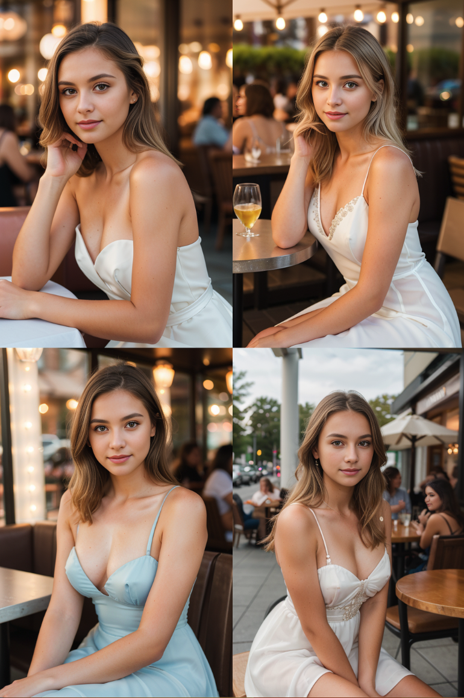
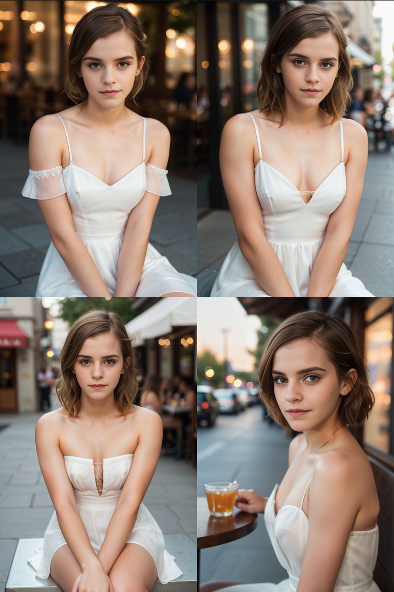
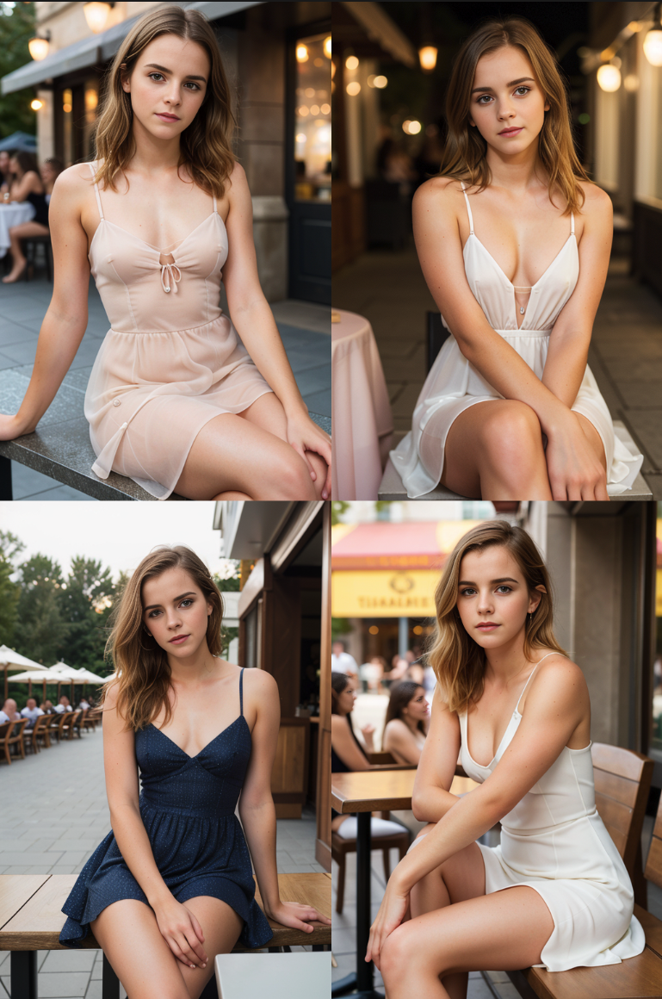
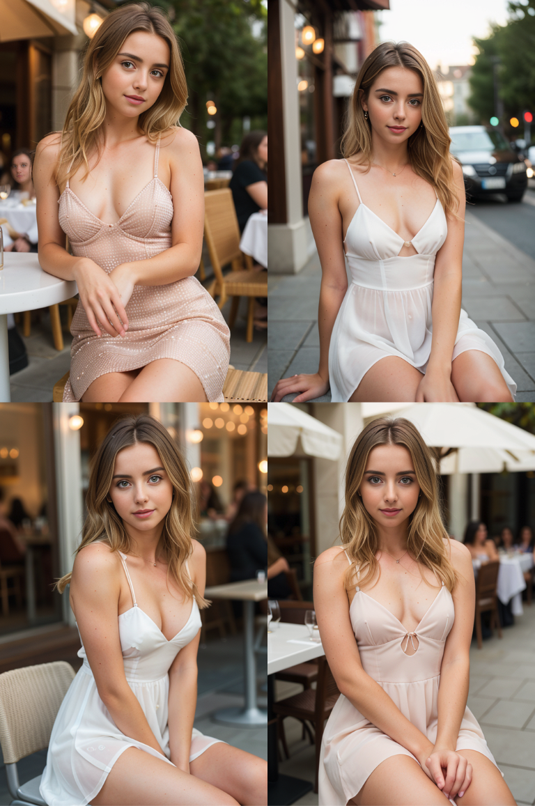
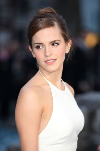
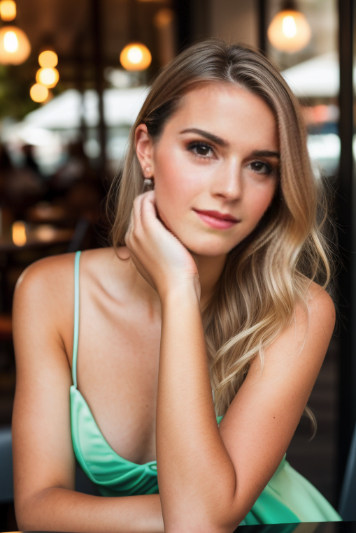
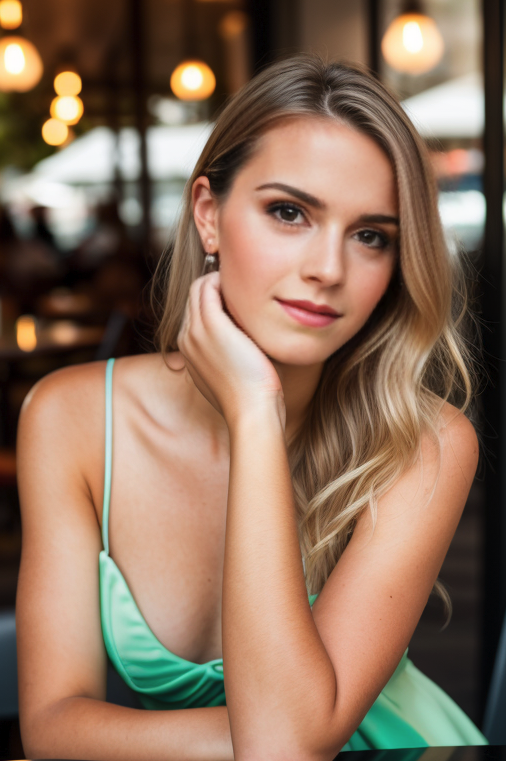
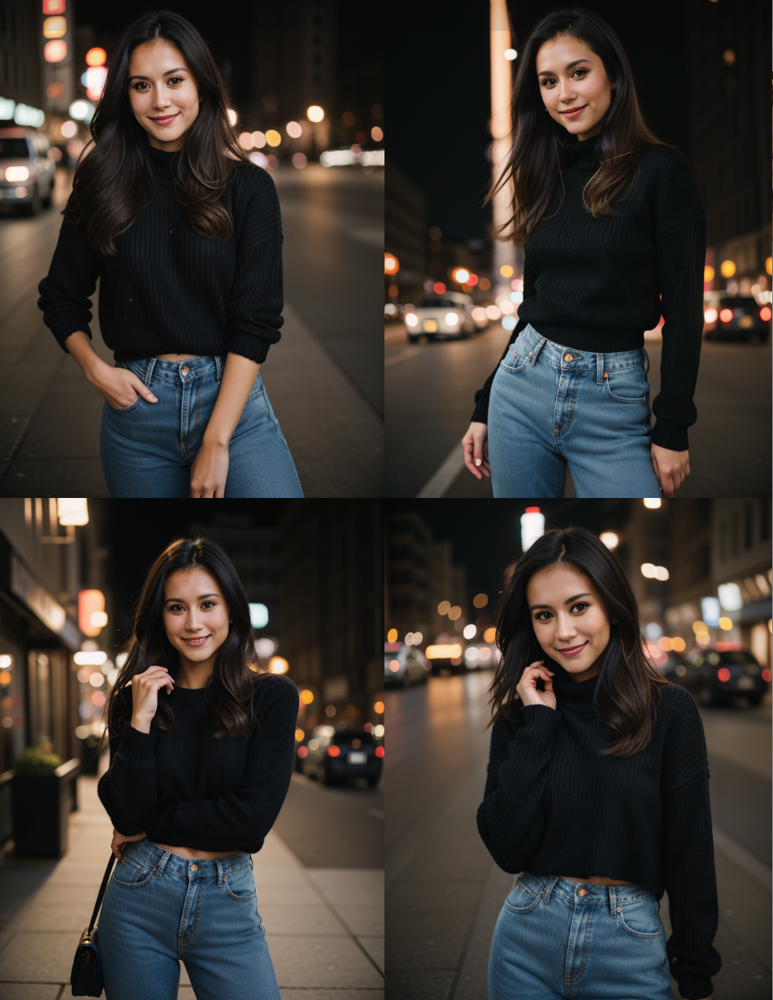
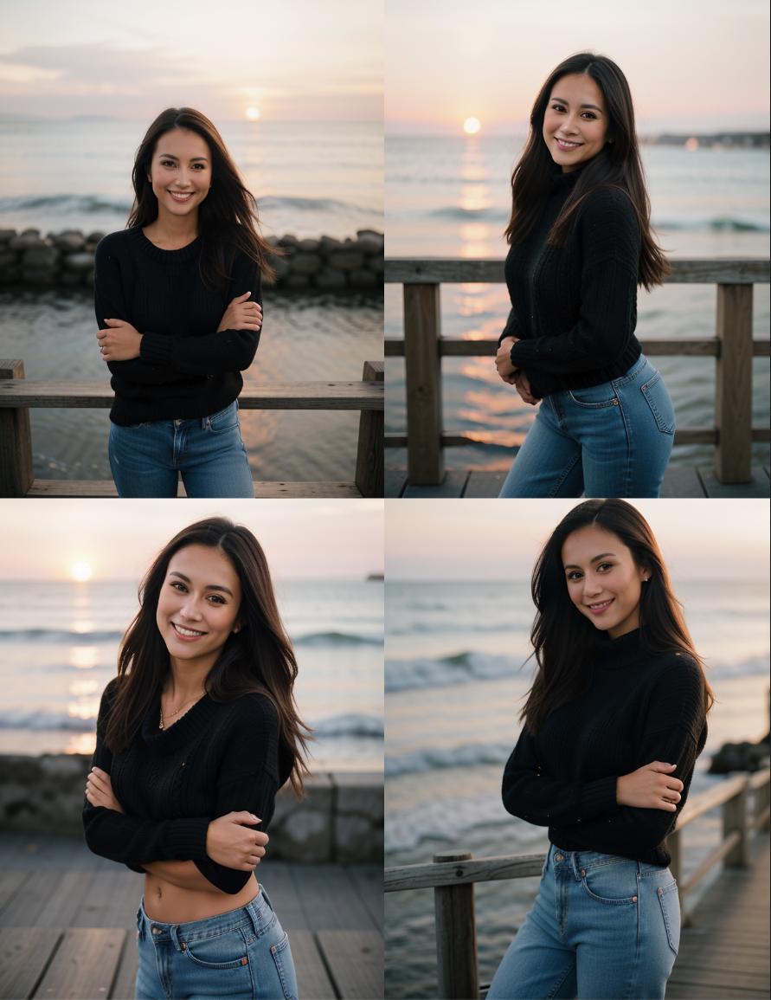

# 生成一致性人脸方法

[TOC]

## 方法一：设定名字

### 1.1 使用多个名人名字

使用名人的名字是生成一致面孔的可靠方法。让我们研究一下下面的基本提示，它会生成一个通用面。

Base prompt:

> photo of young woman, highlight hair, sitting outside restaurant, wearing dress, rim lighting, studio lighting, looking at the camera, dslr, ultra quality, sharp focus, tack sharp, dof, film grain, Fujifilm XT3, crystal clear, 8K UHD, highly detailed glossy eyes, high detailed skin, skin pores

We will use the same negative prompt for the rest of this article.

> disfigured, ugly, bad, immature, cartoon, anime, 3d, painting, b&w



<span style="color:red;">其实她们看起来也像是一个人，使用的是 eplicrealism 模型，说明该模型本身底模多样性不足</span>

他们是很好的面孔，但他们长得不同。有时，你希望在多个图像中生成同一张脸。

名人的名字会有一个强大的影响。使用它们是生成一致人脸的一种行之有效的方法。

让我们在“稳定扩散”中为提示添加一个强名称——Emma Waston。

> Emma Watson, photo of young woman, highlight hair, sitting outside restaurant, wearing dress, rim lighting, studio lighting, looking at the camera, dslr, ultra quality, sharp focus, tack sharp, dof, film grain, Fujifilm XT3, crystal clear, 8K UHD, highly detailed glossy eyes, high detailed skin, skin pores



但是，如果你不想要任何可识别人脸的图像呢？你只需要在多个图像中显示一张普通的脸。这是有技巧的。你可以使用**多个名人名字**将他们的脸融合成一张统一的脸。

让我们用这三个名字：**Emma Watson, Tara Reid, and Ana de Armas**。“稳定扩散”将获取所有 3 个人脸，并将它们混合在一起以形成一个新面。

> Emma Watson, Tara Reid, Ana de Armas, photo of young woman, highlight hair, sitting outside restaurant, wearing dress, rim lighting, studio lighting, looking at the camera, dslr, ultra quality, sharp focus, tack sharp, dof, film grain, Fujifilm XT3, crystal clear, 8K UHD, highly detailed glossy eyes, high detailed skin, skin pores



这很好。这些图像中的人脸是一致的。但为什么他们看起来如此像……Emma？原因是 Emma Watson 是 Stable Diffusion 中一个非常强的关键词。你必须用关键词权重 (keyword: weight) 语法加以控制。

> (Emma Watson:0.5), (Tara Reid:0.9), (Ana de Armas:1.2), photo of young woman, highlight hair, sitting outside restaurant, wearing dress, rim lighting, studio lighting, looking at the camera, dslr, ultra quality, sharp focus, tack sharp, dof, film grain, Fujifilm XT3, crystal clear, 8K UHD, highly detailed glossy eyes, high detailed skin, skin pores



使用多个名人名字和关键词权重来仔细调整你想要的面部特征。你也可以在反向提示中使用名人的名字来避免你不想要的面部特征。

### 1.2 使用虚构人物名称

> **[Wighteyeguy](https://www.youtube.com/@thewighteyeguy)** 的评论：https://stable-diffusion-art.com/consistent-face/

对于 prompt 方法，使用完全虚构的名称并生成一致的面。这有点偶然，但它很管用！同样，你也可以使用数字…。因此，你可以将“种子”和参数值放在括号中，也可以使用混合方法混合两个种子以获得一致的人脸。同样，在你找到一个你喜欢的组合之前，有些偶然——但两者的优点是，它们不必看起来像某个知名的名人。很明显，你可以进一步指导年龄和长相，但我发现它的效果始终如一，非常有用！

因此，例如，我使用这样的提示：“40 year old woman, [99576:12345:0.5]”，并相当一致地得到同样漂亮的深色头发。如果我使用的是一个虚构的名字，我会经常使用中间名来使它更加独特。例如，“40 year old woman, (Michelle Alice Bullock:1.3)” 几乎每次都给我同样的黑皮肤女人。你也可以在 Adeteller 提示中输入相同的公式。

<span style="color:red;">实测效果一般，有几分相似，但不如前几种方法效果好</span>

> 使用技巧：
>
> 随机名字生成器 https://www.behindthename.com/random/
>
> prompt 中可以加入，“a photo of [generated name]” ，替换为自己选择的任务姓名，并可加入诸如“35 years old” 等年龄以及国籍或地理区域等信息，这很重要！

## 方法二：插件

### 2.1 Roop 插件

Roop 扩展可以将参考照片中的人脸复制到使用“稳定扩散”生成的图像中。单独的 roop 程序可以为视频做到这一点，但该扩展仅支持变换图像。

> photo of young woman, highlight hair, sitting outside restaurant, wearing dress, rim lighting, studio lighting, looking at the camera, dslr, ultra quality, sharp focus, tack sharp, dof, film grain, Fujifilm XT3, crystal clear, 8K UHD, highly detailed glossy eyes, high detailed skin, skin pores

> disfigured, ugly, bad, immature, cartoon, anime, 3d, painting, b&w

Model: Realistic Vision 5.1

* Reference image:



* Restore face: None
* Upscaler: None
* 启用 Enable

<table>
  <tr>
    <td>
      
      <p>上述 Prompt 出图</p>
    </td>
    <td>
      
      <p>相同seed下roop换脸</p>
    </td>
  </tr>
</table>
<span style="color:red;">可以成功换脸，但是面部清晰度较低</span>

#### 锐化面部

你可能已经注意到，这些脸在变了的时候有点模糊。有三种方法可以产生更清晰的图像。

1. 使用高分辨率参考图像。
2. 使用面部修复。
3. 来一轮 img2img。
4. 使用 dreambooth 创建新的模型 (下一节)

##### 使用面部修复功能

- **Restore face**: CodeFormer
- **Restore visibility**: 0.5

面部修复可以改变面部的风格，使其看起来像人造的。你可以应用最低的**恢复可见性（restore visibility）**。

<table>
  <tr>
    <td>
      
      <p>原图</p>
    </td>
    <td>
      
      <p>不加 codeformer</p>
    </td>
    <td>
      
      <p>codeformer, Restore visibility = 0.5</p>
    </td>
    <td>
      
      <p>codeformer, Restore visibility = 0</p>
    </td>
  </tr>
</table>
能好一些，但是和原图相比，还是比较模糊。

##### 来一轮 img2img

另一种方法是使用 img2img。使用 Roop 生成人脸交换图像后，使用图像画布下的**发送到 img2img **按钮将生成的图像发送到 img2img。

然后设置去噪强度 **denoising strength** to 0.1，其他设置保持不变：

<table>
  <tr>
    <td>
      
      <p>换脸后未加 CodeFormer</p>
    </td>
    <td>
      
      <p>来一轮 img2img</p>
    </td>
  </tr>
</table>
### 2.2 FaceSwapLab 插件

本以为是个不错的插件，看了[官方](https://github.com/glucauze/sd-webui-faceswaplab) readme 中有关“爱因斯坦”人脸的演示视频，一言难尽，不能说不像，感觉只有 30% 左右的相像。

## 方法三：模型训练

### 3.1 Dreambooth 训练

也许生成同一张脸最可靠的方法是使用 Dreambooth 创建自己的稳定扩散模型。

Dreambooth 是一种使用自己的主题或风格创建**新的稳定扩散检查点模型**的技术。在这种情况下，拍摄对象将是拥有你想要的面孔的人。

你需要关于某个人的几张图片。

收集训练图像可能是一项挑战。这里有几个选项：

1. 请求你认识的人允许使用他/她的照片。
2. 自拍
3. 使用上面的**多个名人姓名**方法生成训练图像。
4. 使用上面的 **Roop 方法**生成训练图像。

#### 步骤一：用 Roop 生成训练数据

使用 Roop 生成具有相同面部的 8 到 15 个图像。以下是训练图像的两个示例。使用模糊的图像是比较好的。

#### 步骤二：用 Dreambooth 生成新的 checkpoint

由于我们希望训练具有逼真风格的模型，我们可以使用 Realistic Vision 系列模型，比如 [Realistic Vision v2](https://huggingface.co/SG161222/Realistic_Vision_V2.0)。

你的新女孩将被称为 `zwx`，这是稳定扩散中一种不常用但存在的 token。由于 `zwx` 是女性，**实例提示**为：

> photo of zwx woman

**class** 是 `zwx` 所属的类别，即 **women**。所以**类提示**是

> photo of woman

通过正确定义类提示，你可以利用模型中女性的所有先前属性，并将其应用于到你的的女孩。

（具体训练过程，略）

#### 步骤三：模型使用

现在，在提示下输入你女孩的名字 `zwx` 进行测试：

> photo of young **zwx** woman, highlight hair, sitting outside restaurant, wearing dress, rim lighting, studio lighting, looking at the camera, dslr, ultra quality, sharp focus, tack sharp, dof, film grain, Fujifilm XT3, crystal clear, 8K UHD, highly detailed glossy eyes, high detailed skin, skin pores

也可以生成这个人的不同风格：

> oil painting of zwx young woman, highlight hair

> disfigured, ugly, bad, immature, b&w, frame

### 3.2 Lora 训练

Lora 相对 Dreambooth 是一种轻量级的训练方法。最好是能收集关于某个人的一组不同风格的照片（事实上这可能并不容易）进行 Lora 训练。具体训练方法，这里参考的是：

* [Creating a LoRA weight using kohya_ss GUI, part 1: Dataset creation and preparation](https://www.youtube.com/watch?v=N4_-fB62Hwk)
* [Creating a LoRA weight using kohya_ss GUI, part 2: Training the model and creating outputs](https://www.youtube.com/watch?v=k5imq01uvUY)

在第一部分中，主要介绍的是如何搜集准备图片数据，比较重要的几个点是：

* 用 kohya_ss 工具训练是一些文件的目录组织结构以及命名规则等
* 图片的准备要尽可能高清化（可通过一些高清化算法或工具实现），并可以根据需要裁剪掉无关部分
* 关于人物尽可能涵盖不同的角度、背景、风格等
* 提取图片字幕并人工修改调整，使其尽可能准确

在第二部分中，主要介绍了 kohya_ss 工具的使用方法以及一些参数的含义，并演示训练以及使用推理的过程等


## 方法四：ControlNet 参考图

> video:[The Truth About Consistent Characters In Stable Diffusion](https://www.youtube.com/watch?v=WQsUeyzq-VA)
>
> key idea of the video:
>
> - 📝 00:00 在稳定扩散中实现 100% 的一致性是不正确的，但通过从一个好的模型开始，给你的角色命名，使用随机名称生成器，并保持一致的种族，你可以达到 80-90% 的一致性。
> - 📝 01:05 演讲者解释了如何通过从提示开始并尝试不同的外观，然后将所选图像导入控制针织来在稳定扩散中创建一致的角色。
> - 💡 02:05 使用全身照片或至少从膝盖以上拍摄，根据需要启用 Pixel Perfect，然后选择控制权重为 1 的参考模型。
> - 👕 02:30 演讲者讨论了角色设计中一致性的重要性，并展示了具有一致面部特征和服装的生成图像的示例。
> - 👕 03:15 服装保持一致且可互换，可以轻松更改背景、地点和服装。
> - 📷 04:23 人工智能生成的图像可用于真实照片，允许用户改变拍摄环境或生成类似于特定人物的图像。
> - 😅 05:26  除了毛衣的颜色和牛仔裤上的纽扣等小细节外，角色的外观基本一致。
> - 📷 06:04  增加风格保真度滑块以提高创建角色图像的一致性，利用参考控制创建不同的姿势和环境，并在未来的视频中将故事与其他角色拼凑在一起。

Model: realisticVisonV51_v51VAE

Sampling method: Euler a

首先使用虚拟人名，这里采用了两个 alisa tisson katey dobrev，而且加入了年龄信息 40yr old，生成了一批看起来高度近似的人脸照片

```
Prompt: analog style , half body portrait , 40yr old alisa tisson katey dobrev , filipino , smiling , fashionable black sweater , jeans , black hair blonde highlights model poses , city at night , shallow depth of field , dslr , soft lighting , high quality , film grain , hasselblad , helios 44-2 58mm f2
Negative Prompt: ( deformed iris , deformed pupils , semi-realistic , cgi , 3d , render , sketch , cartoon , drawing , anime , mutated hands and fingers : 1.4 ) , ( deformed , distorted , disfigured : 1.3 ) , poorly drawn , bad anatomy , wrong anatomy , extra limb , missing limb , floating limbs , disconnected limbs , mutation , mutated , ugly , disgusting , amputation
```



接下来，我们稍微修改一下 Prompt，将 “city at night” 改为 “pier at sunset”(日落的码头)，并将上述生成的图片，比如第二张作为参考图。

选择 ControlNet，勾选“Enable”，也可以勾选“Pixel Perfect”，Control Type，选择“Reference”，预处理器选择“reference_only”，控制权重（Control Weight） 通常在 0.7~1，风格保真度（Style Fidelity）0.5 可以保持较高的一致性，



可以看到人物基本保持一致，服装整体效果也有较好的迁移，但服装细节无法 100% 保证，比如领口、裤子拉链纽扣等，对于复杂服装，可能更差。


---------------

